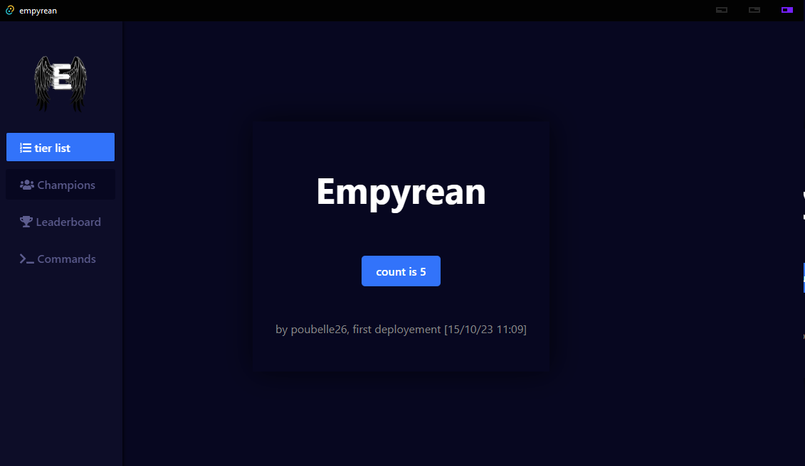

# Empyrean

Empyrean is a project created using HTML, CSS, JavaScript, Rust.
Using React.js, and Tauri.



## Table of Contents

- [About](#about)
- [Getting Started](#getting-started)
- [Contact](#contact)

## About

Empyrean is a desktop/web application built with HTML, CSS, JavaScript, Rust, React.js, and Tauri.


## Getting Started

To get started with Empyrean, follow these steps (you have to build it for now):

1. Clone the repository:

   ```shell
   $ git clone https://github.com/p0ubelle/empyrean.git
   $ cd empyrean
   $ yarn tauri build

go to "src-tauri\target\debug\empyrean.exe"

## Contact
- email : raphael.vasseur26@proton.me
- discord : p0ubelle
